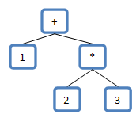

# 表达式运算

这里将展示如何计算形如:`1+2*3`的表达式.

## 表达式表示法

根据操作符所在位置的不同,这里有三种表示法:

- 前缀表示法(prefix notation): `操作符` `操作数1` `操作数2`,例如 `+ 1 2`
- 中缀表示法(infix notation):`操作数1` `操作符` `操作数2`,例如`1 + 2`
- 后缀表示法(postfix notation):`操作数1` `操作数2` `操作符`,例如 `1 2 +`

通常符合我们直觉的是中缀表示法,但是运算这样的表达式是不可能的,因为操作符有不同的优先级,而且还有括号影响运算顺序. 所以可以通过两种方式来将其转换成可运算的表达式.

### 逆波兰表示法(RPN:Reverse Polish Notation)

逆波兰表示法是后缀表示法,通过将中缀表示法转换为后缀表示法,从左到右计算.例如`1+2*3`将会被转换为`1 2 3 * +`. 从左到右将`token`压栈,直到找到运算符,然后运算表达式得到结果替换栈顶部值.

运算`1 2 3 * +`示例如下:

| 输入 | 操作     | 堆栈  | 释义                 |
| ---- | -------- | ----- | -------------------- |
| 1    | 入栈     | 1     |                      |
| 2    | 入栈     | 2,1   |                      |
| 3    | 入栈     | 3,2,1 |                      |
| \*   | 乘法运算 | 6,1   | 3,2 出栈,结果 6 入栈 |
| +    | 加法运算 | 7     | 6,1 出栈,结果 7 入栈 |

经过上述步骤令牌数组遍历完成,栈中的结果`7`即为运算结果.

将中缀表示转换为后缀表示的算法为调度场算法-[Shunting-yard algorithm](https://en.wikipedia.org/wiki/Shunting-yard_algorithm).

还有其它构造后缀表达式的方式,譬如一旦抽象语法树构造完成,通过树后续遍历即可得到逆波兰表示.

具体介绍参见[Reverse Polish notation](https://en.wikipedia.org/wiki/Reverse_Polish_notation).

### 抽象语法树(AST:Abstract Syntax Tree)

抽象语法树是表达式的抽象表示,其中节点表达操作符,叶子节点表示操作数.例如`1+2*3`的抽象语法树为:



有了抽象语法树之后,运算就相对简单了.从根节点开始根据操作符执行运算,如果子节点也是操作符,那么执行子节点的运算,采用递归的方式最终运算出整个表达式的值.

## 表达式语法

描述编程语言语法也有相应的理论和方式方法,譬如扩展巴科范式斯-[EBNF:Extended Backus-Naur form](https://en.wikipedia.org/wiki/Extended_Backus%E2%80%93Naur_form).

这里展示一种表达式的表示方式,仅供参考:

```bat
EXP    ->  TERM EXP1
EXP1   ->  + TERM EXP1 |
           - TERM EXP1 |
           epsilon
TERM   ->  FACTOR TERM1
TERM1  ->  * FACTOR TERM1 |
           / FACTOR TERM1 |
           epsilon
FACTOR ->  ( EXP ) |
           - EXP   |
           number
```

其中`epsilon`意为着`空`.具体涵义参见[Evaluating Expressions – Part 1: The Approaches](https://mariusbancila.ro/blog/2009/02/03/evaluating-expressions-part-1/).

## 表达式解析之令牌化

按照之前为表达式定义的语法,可以将字符串拆解为令牌组,由于有语法定义,过程中能够用来检测语法正确与否.

实现参见`parserDemo.cpp`.

## 表达式解析之构建抽象语法树

实现参见`parseAsAST.cpp`.

## 抽象语法树运算

在构造完抽象语法树之后即可进行运算.

实现参见`parseAsAST.cpp`.

## 总结

可以看到,表达式运算的核心在于定义表达式语法,表达式语法决定了抽象语法树,但是抽象语法树的运算自身是独立的.
